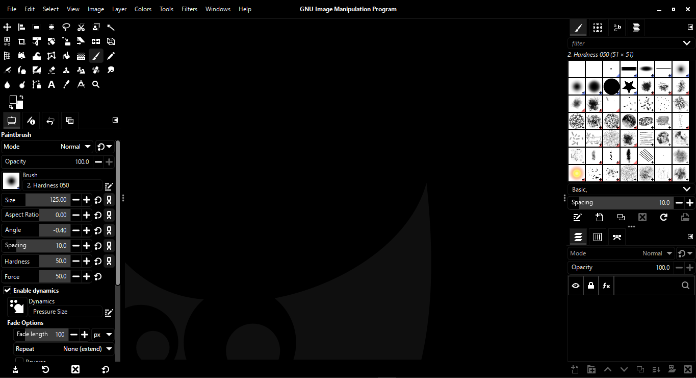

# Amoled for GIMP
An AMOLED theme for GIMP that replaces the main dark theme for times when the default theme is too bright.

Download GIMP here: https://gimp.org/downloads/

Note: you must reinstall the theme with each update

# How to install:

GIMP 3:
paste and replace files in: `C:\Users\your_user\AppData\Local\Programs\GIMP 3\share\gimp\3.0\themes\Default`

# Preview

